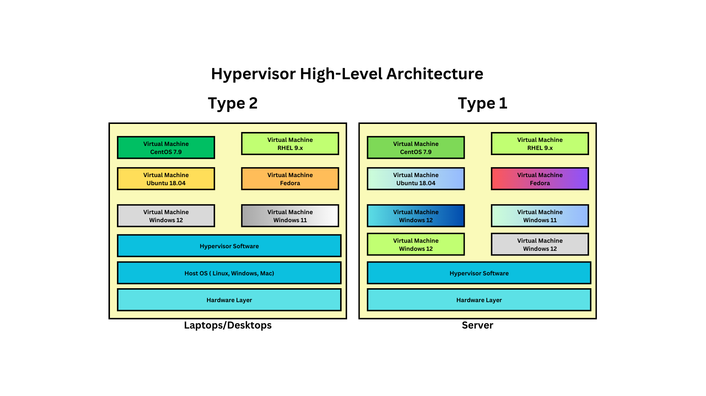

# Day 1

## Info - Hypervisor Overview
<pre>
- Virtualization technology
- in order to install additional OS, we need to create a Virtual Machine (VM) and then install the OS within the VM
- the OS that runs within the VM are called Guest OS
- the Guest OS believes it is running on a separate Server/Machine
- each VM must be allocated with dedicated H/W resources
       - CPU ( Logical/Virtual CPU Cores )
       - RAM (Actual)
       - Storage ( Actual )
       - Network (Virtual )
       - Graphics Card ( Virtual )
- Processor
  - AMD 
    - Virtualization instruction set is referred as AMD-V
  - Intel 
    - Virtualization instruction set is referred as VT-X
- There are 2 flavours of hypervisor
  1. Type 1 - a.k.a Bare Metal Hypervisor
     - this doesn't require any Host OS on the server, we can directly install Type 1 Hypervisior
     - is used in Servers & Workstations
     - examples
       - VMWare vSphere(vcenter), Microsoft Hyper-V, Linux KVM

  2. Type 2 - a.k.a Hosted Hypervisor
     - is used in Desktops, Laptops & Workstations
     - Hypervisor can only be installed on top of Host OS ( Windows, Linux or Mac OS-X )
     - examples
       - VMWare Wokstation ( Linux & Windows )
       - VMWare Fusion ( Mac OS-X )
       - Parallels ( Mac OS-X )
       - Oracle VirtualBox ( Linux, Windows & Mac )
- HyperThreading or SMT
  - each Physical CPU Core is equalivalent to 2 Logical/Virtual Cores
- Server Motherboards supports multiple Processors Sockets
  - Imagine a Server Motherboard has got 8 Processor Sockets
  - MCM (MUltiple Chip Module ) i.e multiple Processors can be packaged in a single IC
    - 2 Processors per MCM IC Chip
  - Each Processor may support
    - 128/256 CPU Cores
  - 8 Sockets x 2 Processors x 128 = 2048 Physical CPU Cores = 2048 x 2 = 4096 Logial/Virtual Cores
- this type of Virtualization is called heavy-weight virtualization
  - because each VM requires its own dedicated H/W resources
  - each OS that runs within the VM is a fully-function OS
- each VM, represents a single OS
</pre>

## Info - Containerization
<pre>
- Containerization is a light-weight virtualization technology
- unlike VMs, containers that runs on same server/machine will share the hardware resources on the underlying host OS
- containers are light-weight compared to VMs
- containers are faster compared to VM
- containers runs in it owns namespace
  - each container uses about 5~6 different namespaces
    - PID namespaces
    - Network namespace
- Each container or a group of containers represents a single application
- in many ways Container resembles a Virtual Machine (OS)
- just like each VM aquires its own IP address, each container get an IP address
- just like VM has a network stack and NIC, container also get a network stack and NIC
- just like the OS has its own filesystem and command prompt/terminal, containers also supports command prompt/terminal
- just like VM has its own port range ( 0 to 65535 ), containers also get its own port range
- but technically containers are just a Process in the Operating System it is not an OS
- technically, containers will never be able to replace OS/VM
- practically speaking, in production, one Physical Server will host many Virtual Machines, each Virtual Machine may be hosting multiple containerized
  applications
- examples
  - Docker
  - Containerd
  - Podman  
- Containerization is a Linux technology
- in Linux Kernel
  - there are 2 features which makes the Containerization possible
    1. Namespace
       - helps in isolating one container from the other containers
    2. Control Groups (CGroups)
       - helps in applying container level resource quota restrictions 
       - we can control, how much storage one container can utilize at the max
       - we can control, how many CPU cores one container can utilize at the max
</pre>

## Info - Container Runtime
<pre>
- is a low-level software that helps managing containers and images
  - it can create, start, stop, restart container
  - it can download,list, create and delete images
- it is not end-user friendly, hence normally no end-users like us use Container Runtimes directly
- examples
  - cRun
  - runC
  - CRI-O
  - rkt 
</pre>

## Info - Container Engine
<pre>
- is a high-level end-user friendly software that helps managing containers and images 
- under the hood, Container Engines depends on Container Runtimes to manage containers and images
- examples
  - Docker
    - depends on Containerd, which in turn depends on runC Container Runtime 
  - Podman
    - depends on CRI-O Container Runtime
</pre>

## Info - Container Images
<pre>
- is a set of files, which acts as a specification of a Container
- a blueprint of a container
- Container Images is a collection of many Container Image Layers
- each Container Image Layers brings 
  - set of folders and files
- the combination of many image layers, provides the filesystem for  container
- image layers are shared by one or more Container Images
- the Docker Image format has become the industry standing image format called OCI
- any number of containers can be created using the same image
- it is similar to Windows11-OS-DVD.iso of Ubuntu2604-OS-DVD.iso
</pre>

## Info - Containers
<pre>
- is a running instance of a Container Image
- each container runs in a separate namespace
- each container gets one or more Private IPS
- each container has its own software defined Network Card and network stack
- each container has its own Port range 0-65535
</pre>

## Info - What kind of applications we can containerized ?
<pre>
- any server application can be containerized efficiently
- examples
  - microservices
  - Web Servers
  - Application Server
  - Database Servers
  - Message Queue Servers
  - REST API
  - SOAP API
  - Web Services
- anything that runs forever can be containerized
</pre>

## Info - Hypervisor High-Level Architecture


## Info - Docker High-Level Architecture


## Lab - Finding docker version and details
```
docker --version
docker info
```


Troubleshooting permission denied error
```
newgrp docker
docker images
```

## Lab - Listing docker images from Local Docker Registry 
```
docker images
```


## Lab - Creating containers in interactive mode
```
# As soon as you run the below command, docker server, creates a new container and will take us inside the container shell
# The terminal shell prompt before running this command and after running this command will be different
docker run -it --name c1-jegan --hostname c1-jegan ubuntu:latest /bin/bash

# Whatever you type here are running within the container shell
# Find the IP address of the container
hostname -i

# Find the hostname of the container
hostname

# List the file and folders
ls -l

# This will exit the container shell
# As only container shell is running in the container, once terminal exits the container also stops running (exits )
exit

# On your lab machine, is the command to list all running containers, you will not see the c1-jegan container as it already exited(stopped)
docker ps

# List all containers including exited ones
docker ps -a
```


In the docker run command, let's understand the switches
<pre>
it - interactive terminal
name - name of the container, this one is optional, if we don't provide name, docker engine will randomly assign a name 
hostname - hostname of the container, this is optional as well, if we don't provide hostname docker engine will assign container ID as hostname
ubuntu:latest - is the docker container image name, latest is the latest version or tag
bin/bash - this will start the bash terminal inside the container
</pre>

## Lab - Starting the exited containers
```
docker start c1-jegan 
```

## Lab - Getting inside the running container shell
```
docker exec -it c1-jegan /bin/bash
```

## Lab - Let's create nginx web server container in background(daemon/detached) mode
```
docker run -d --name nginx1-jegan --hostname nginx1-jegan nginx:latest 
```

List all the running containers
```
docker ps
```

Check the logs
```
docker logs nginx1-jegan
```


## Lab - Restart the container
```
docker restart c1-jegan
docker restart c2-jegan c3-jegan c4-jegan
```


