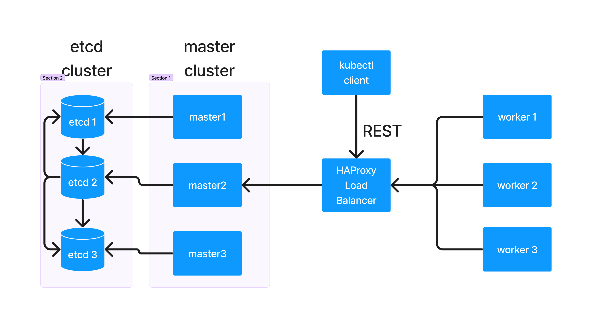

# Day 2

## Info - Container Orchestration Platform
<pre>
- the motivation for using Container Orchestration Platforms
  - in-built load-balancing
  - in-built monitoring and self-healing
  - in-built scale up/down manually/automatically
  - rolling update
    - upgrading your already live application from one version to other without any downtime
    - rollback to older stable version if required
  - service discovery
    - accessing an application using its service name
    - in-built dns to resolve the service name to its corresponding IP address
  - service ( represents a group of Pods from a single application )
    - service name and server IP is stable but Pods are temporary
    - internal
    - external
- examples
  - Docker SWARM ( Docker's native Container Orchestration Platform )
  - Google Kubernetes ( Command-line only )
  - Rancher ( Kubernetes with Webconsole )
  - Red Hat Openshift ( Red Hat's distribution of Kubernetes )
  - ROSA (Managed - Openshift cluster from AWS )
  - ARO ( Managed - Opeshift cluster from Azure )
  - eks ( Managed Kubernetes cluster from AWS )
  - aks ( Managed Kubernetes cluster from Azure )
</pre>

## Info - Docker SWARM Overview
<pre>
- Docker's native Container Orchestration Platform
- it is opensource
- it only supports Docker Containerized applications to be deployed
- it is very light-weight, easy to setup, easy to learn
- ideal for learning, dev/qa setup
- not production-grade
</pre>  

# Info - Kubernetes
<pre>
- developed by Google with Go language
- it is opensource, and supports only command-line interface
- it is robust, hence it is production-grade
- there are several ways to install Kubernetes
- inside Google, it was originally developed and used as borg project
- later, borg was refactored and donated to Cloud Native Cloud Foundation in the name Kubernetes
  that's how it has become open-source
- it supports Role Base Access Control but no User Management
- there is a namespace concept, every team can create their own application deployment in a Kuberenetes namespace
- namespace is a way to seggregate the application deployments between teams
- Kubernetes works as a cluster of many machines(nodes)
- Kubernetes nodes can be
  - Physical Server
  - Virtual Machine
  - an ec2 instance in AWS
  - an azure vm
- there are 2 types of Nodes
  - Master Node
    - Control Plane components only runs in the master node
    - Control Plane Components are also Pods
      1. API Server
      2. etcd - key/value datastore
      3. Scheduler
      4. Controller Managers ( collection of many Controllers )
  - Worker Node
    - user application are deployed here as Pods
- these are built-in type of resources supported by Kubernetes (k8s)
  - Pod
  - ReplicaSet
  - Deployment
  - DaemonSet
  - StatefulSet
  - Job
  - CronJob
  - Service
  - EndPoint
- Kubernetes also supports adding our own custom resources types and we can extend K8s API and features
- the basic build blocks required to extend K8s comes out of the box in K8s
  - Custom Resource Definitions (CRD) - we can add new type of Resource by creating CRD yaml file
  - To manage our custom resource, we also need to provide our own Controller
- application can be deployed and managed in 2 style
  - imperative style ( plain commands in CLI )
  - declarative style ( yaml file - manifests )
</pre>

## Info - Pod
<pre>
- is a logical grouping of related Containers
- the smallest unit that can be deployed in Kubernetes/Openshift is Pod
- all containers in a Pod, shares the same network, ports, IP-address
- is a configuration object/resource that is stored and managed in etcd database by API Server
- a built-in resource type supported in Kubernetes & Openshift
</pre>

## Info - ReplicaSet
<pre>
- an in-built resource type supported in Kubernetes & Openshift
- it is a Configuration Object/Resource stored and managed by etcd datastore 
- ReplicaSet capture below details
  - desired number of Pods that must be created/running
  - Container Image that must be used 
  - labels selectors that are used to identify the respective Pods
</pre>

## Info - Deployment
<pre>
- is a built-in resource type that is maintained in etcd database by API Server
- it is used to deploy stateless application
- Deployment has one or more ReplicaSets
- ReplicaSet has one or more Pods
- Pods has one or more Containers
</pre>

## Info - Type of applications
<pre>
- Stateless ( Deployment )
- Stateful  ( StatefulSet )
- One time Job ( Job )
- Recurring Jobs (CronJob)
- Running one Pod per Node ( DaemonSet )
</pre>

## Info - Control Plane Components
<pre>
- collectively all 4 components supports the Container Orchestration Platform features
- all the Control Planes components are all also called as Static Pods
- the Control Planes components are created and managed by kubelet Container agent that runs on every node
- kubelet is service not a Pod
- whenever the node OS is booted, the kubelet service is started automatically, and kubelet starts the control plane
- kubelet also runs on worker nodes, kubelet communicates with the Container Runtime to pull, create and manage the containers
  on the node where kubelet is running
- kubelet monitors the status of all Pod containers that runs on the current node and keeps reporting the status to API Server
  at regular intervals in a heart-beat fashion
</pre>

## Info - API Server Control-Plane Component (Pod)
<pre>
- this is the heart/brain of Kubernetes
- it maintains the Cluster and application status in the etcd distributed database
- ApI Server is the only component that can read/write to/from the etcd database
- all the Kubernetes components they communicated only to API Server via REST API calls
- API Server has REST API for all the features supported in Kubernetes
- Whenever API SErver updates the etcd database, API Server will send a event about the update
</pre>

## Info - etcd (Pod)
<pre>
- it is an opensource independent project
- it is a distributed database that stores and retrieves data as key/value
- generally this works as a cluster - a group of etcd databases as a cluster
- hence when data is updated on one instance of etcd, it automatically gets synchronized in other instances of etcd database
</pre>


## Info - Scheduler (Pod)
<pre>
- this component is responsible to identify in which node a new Pod can be deployed
- the Scheduler by itself can't schedule the pods on any node, it can only identify a healthy node where a Pod can be 
  deployed, this scheduling recommendation is forwarded to API Server via REST call by Scheduler
</pre>

## Info - Controller Managers (Pod)
<pre>
- it is a collection of many Controllers
- each Controller manages one type of Kubernetes Resource
- example
  - ReplicaSet Controller takes ReplicaSet as an input and manages Pods
  - Deployment Controller takes Deployment as an input and managed ReplicaSet
  - StatefulSet Controller takes StatefulSet as input and manages Pods
</pre>

## Info - How many masters nodes are recommended in K8s/Openshift ?
<pre>
- Each master nodes has its own dedicated etcd database
- etcd database works as a cluster
- it is always recommended to go for odd numbered etcd instances i.e 1, 3, 5, 7
- etcd uses the Raft consensus algorithm to replicate its data across all master nodes
- Total nodes/2 - should be rounded down i.e 1.5 rounds to 1, 2.5 rounds to 2
- Quorum needed = ( Total nodes in cluster /  2 ) + 1
- in the etcd cluster, only one etcd acts as a leader which performs write operation, 
  unless the majority of the total etcd instances confirms(agrees) the leader etcd will not write the data
  - in a single node cluster, there is only 1 etcd so the quorum agreed, the same etcd agrees to all writes so no problem
  - in a cluster with 2 nodes, the quorum requires at least 2 majority, so when both nodes are live everything works fine,
    when 1 goes down, the majority 2 quorum requirement will never be met, so no writes are approved, in a 2 node cluster
    there is 0 tolerance of etcd
  - in a cluster with 3 nodes
    - the quorum requires at least 2 majority
    - when the leader etcd writes, the leader etcd instance and 1 other etcd approves the write operation we are good
    - when 1 of the 3 etcd instances goes down, the quorum is still 2 majority so the tolerance is 1 node can go down, still
      the cluster goes on
    - when 2 etcd instances goes down, the cluster becomes nonoperational
  - in a cluster with 4 nodes
    - the quorum requires atleast 3 etcd instances
    - tolerance is 1, just like 3 nodes, having an extra etcd instance is of no advantage, it only adds overhead in synchronizing data
    - when 1 etcd instance goes down, the cluster works fine as the quorum requirement 3 majority is met
    - when 2 etcd instances goes down, the cluster will not work as the quorum requirement 3 majority is not met
  - in a cluster with 5 nodes
    - the quorum requires atleast 3 etcd instances running healthy
    - when all 5 etcd runs healthy, cluster works fine
    - when 1 etcd goes down, the quorum requirement 3 is still met, so cluster works fine
    - when 2 etcd goes down, the quorum requirement 3 is still met, so cluster works fine
    - when 3 etcd instances goes down, the quorum requirement of 3 majority will not be met, so cluster will become non-operational
- this explains, why odd numbered etcd instance clusters are recommended over the even numbered etcd cluster
- the even numbered clusters provides the same level of tolerance an odd number cluster offers with one less number of etcd instances
- actually there will be an additional overhead drawback in case of even numbered etcd cluster as too many etcd instances, makes the
  data synchronization more complex
</pre>

## Info - Kubernetes High-Level Architecture


## Info - Red Hat Openshift High-Level Architecture


## Lab - Listing all nodes in the Kubernetes cluster
```
kubectl version

kubectl get nodes
kubectl get nodes -o wide
```

## Lab - Listing the control planes components
```
kubectl get pods -n kube-system
kubectl get pods -n kube-system | grep kube-apiserver
kubectl get pods -n kube-system | grep etcd
kubectl get pods -n kube-system | grep kube-scheduler
kubectl get pods -n kube-system | grep kube-controller
```

## Lab - Getting inside one of the master node shell
```
kubectl debug node/master01 -it --image=ubuntu --profile=sysadmin -- chroot /host
crictl images
crictl ps
exit
```

## Lab - Understanding how Pods are created by CRI-O Container Runtime
```
# List all pods in your namespace
kubectl get pod nginx-598cc96cd9-2gvb5 -n jegan -o wide

# In my case the nginx pod is running in master03 node, let's get inside the master03 node and hit Enter key
kubectl debug node/master03 -it --image=ubuntu --profile=sysadmin -- chroot /host

# Find the POD ID
POD_ID=$(crictl pods --name nginx-598cc96cd9-2gvb5 --namespace jegan -q)

# Find the nginx container ID
NGINX_CONTAINER_ID=$(crictl ps --pod $POD_ID -q | head -1)

# Find the network namespace - sandbox(pause) container
NS_FILE=$(crictl inspectp $POD_ID | grep -o '/var/run/netns/[a-f0-9-]*' | head -1)

# Find the nginx container's process ID as seen by the Linux OS
NGINX_PID=$(crictl inspect $NGINX_CONTAINER_ID | grep -m1 '"pid":' | grep -o '[0-9]*')

# Find the container image used to create pause container
crictl inspectp $POD_ID | grep pause

echo "Pod:       nginx-598cc96cd9-2gvb5 (namespace: jegan)"
echo "Sandbox:   $POD_ID (image: registry.k8s.io/pause:3.10.2)"
echo "Container: $NGINX_CONTAINER_ID (nginx, PID $NGINX_PID)"
echo "Net NS:    $NS_FILE"
echo "Pod IP:    $(nsenter --net=$NS_FILE ip -4 addr show eth0 | grep inet | awk '{print $2}')"
```


## Lab - Deploying your first stateless application into Kubernetes cluster
```
# As a best practice, first create a namespace
kubectl create namespace jegan
kubectl get namespaces
kubectl get namespace
kubectl get ns

kubectl create deployment nginx --image=nginx:latest --replicas=3 -n jegan

# List the deployments i.e stateless application
kubectl get deployments -n jegan
kubectl get deployment -n jegan
kubectl get deploy -n jegan

# List the replicasets under jegan namespace
kubectl get replicasets -n jegan
kubectl get replicaset -n jegan
kubectl get rs -n jegan

# List all the pods under namespace jegan
kubectl get pods -n jegan
kubectl get pod -n jegan
kubectl get po -n jegan

# Find the Pod IP and they are running on which node
kubectl get pods -n jegan -o wide
```

## Lab - Understanding Kubernetes describe
Kubernetes describe is equivalent to docker inspect
```
kubectl describe node/master01
kubectl describe node/worker01

kubectl describe deploy/nginx
kubectl describe rs/nginx-598cc96cd9
kubectl describe pod/nginx-598cc96cd9-znx6s
```

## Lab - Understanding Label Selector

Note
<pre>
- In Kubernetes, labels are used as selectors
- Deployment tracks its ReplicaSets using Labels as Selectors
- For instance, Deployment nginx has a label selector like app=nginx, the replicaset has labels app=nginx
- Deployment Controller, if it needs to find the ReplicaSet, it will pick the label selector from Deployment and find the 
  respective Replicaset as shown below
</pre>
```
kubectl describe deploy/nginx -n jegan 
kubectl get rs -n jegan -l app=nginx --show-labels
```

<pre>
- If ReplicaSet controller, need to find the Pods, it will pick the label selector from ReplicaSet and find the respective
  pods as shown below
</pre>
```
kubectl describe rs/nginx-598cc96cd9 -n jegan --show-labels
kubectl get pods -n jegan -l app=nginx,pod-template-hash=598cc96cd9
```

## Lab - Creating Pod with plain docker
```
# The command below creates a pause container, the sole responsibility of this container to support networking
docker run -d --name nginx-pause --hostname nginx registry.k8s.io/pause:3.10.1

# This is an application container(web server), it joins the pause container's network, hence shares the same IP address
docker run -d --name nginx --network=container:nginx-pause nginx:latest
```

Find the IP address of the pause container
```
docker inspect nginx-pause | grep IPA
```

Find the IP address of nginx container
```
docker exec -it nginx /bin/sh
hostname -i
exit
```

## Lab - Listing all the events related to your namespace
```
kubectl get events -n jegan
```

## Lab - Editing Deployment to perform scale up/down
```
kubectl get pods -n jegan

kubectl edit deploy/nginx

# Look for replicas: 3 and replace that with 5, save and exit
kubectl get pods -n jegan # You should see 5 pods now
```

## Lab - Creating an external NodePort service for nginx deployment
Note
<pre>
- Service represents a group of load-balanced pods from a single deployment
- Every service is assigned an unique name and IP address
- Service name and IP is considered stable, hence we can access a group of load-balanced pods
  via its service
- At runtime, service will connect us with any one of the Pods from the Pod endpoint under that service
- Kubernetes reserved port range 30000 to 32767 for the purpose of NodePort external services
</pre>

```
# Find the IP address of all nodes
kubectl get nodes -o wide

# List the nginx deploy
kubectl get deploy -n jegan

# Create an external node port service
kubectl expose deploy/nginx --n jegan --port=80

# List the services
kubectl get services -n jegan

# Accessing service
curl http://192.168.122.15:30615
curl http://192.168.122.130:30615
curl http://192.168.122.80:30615
curl http://192.168.122.229:30615
curl http://192.168.122.93:30615
curl http://192.168.122.230:30615

# Find more details about the node-port service
kubectl describe service/nginx -n jegan

```

## Lab - Getting inside a pod shell
```
kubectl get pods -n jegan
kubectl exec -it -n jegan nginx-598cc96cd9-2762n -- /bin/sh
```

## Lab - Creating LoadBalancer external service
```
kubectl get deploy/nginx -n jegan
kubectl expose deploy/nginx --type=LoadBalancer --port=80 -n jegan
kubectl get svc/nginx -n jegan
curl http://192.168.122.201:80
```
