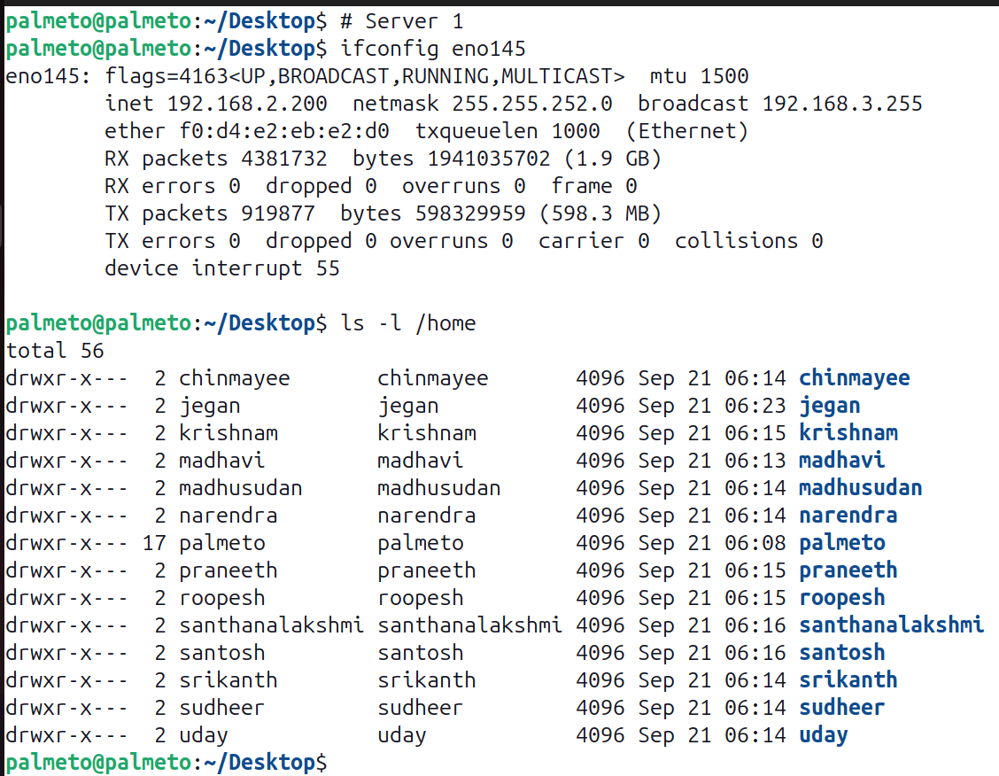
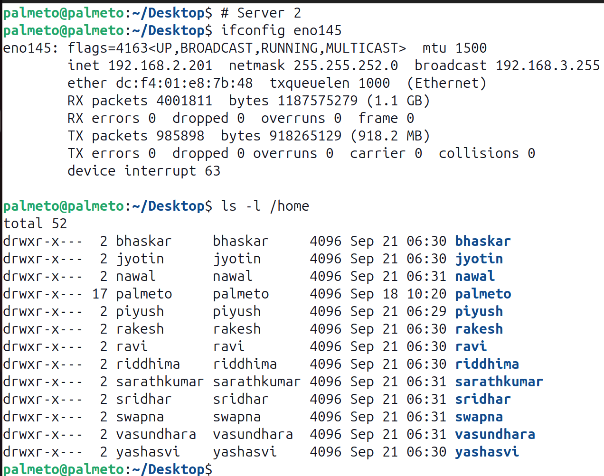

# Docker, Kubernetes & Red Hat Openshift

## Info - Lab details
Server 1

Server 2

## Info - How to connect to your cloud machine
Login to Palmeto Cloud machine with the lab credentials you received from your L&D focal point.

It will then present you an Ubuntu Login, your short firstname will be already typed there, 
you need type the password 'palmeto@123' without quotes.

Copy/Paste between your local machine and Palmeto Cloud is disabled as per your Bank Policy.

Hence, I would suggest you to open this Training Repository on the Cloud Machine Web browser so copy/paste.

## Pre-test url
<pre>
https://forms.cloud.microsoft/r/AgYy4QLta0  
</pre>

Note
<pre>
- Copy/Paste is disabled between your local machine and lab machine is disabled as per your Bank policy
- Kindly complete your pre-test and leave a message in the chat, in case you don't have chat access you 
  can directly confirm once you have completed the test
- Kindly provide your full name while registering for the pre-test, so that your L&D will be able to recognize you
- Kindly do not share your BOFA ID during this training anywhere
- Kindly do not share your screen during this training, you may inform me your Palmeto username, 
  I'll login and help you troubleshoot the lab hands-on exercises.
</pre>
